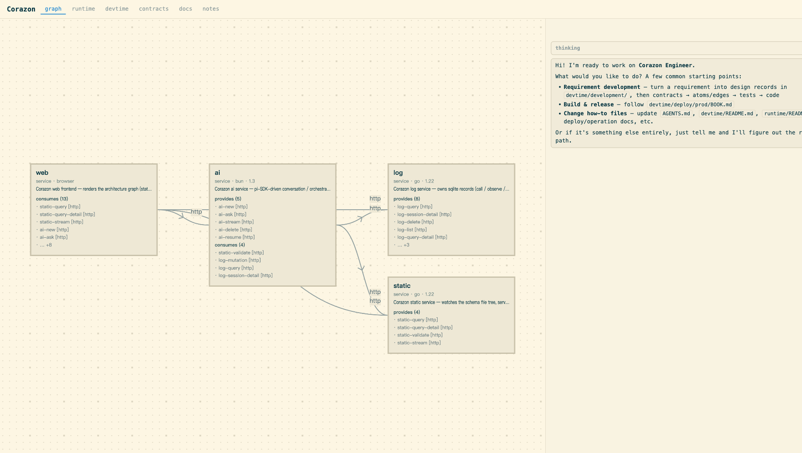

# Corazon Engineer

[中文](README_zh.md)

An **engineering agent** on top of the coding agent.

Turns a system into a small, readable schema — atoms, edges, contracts, runtime — and presents it in an appropriate visualization, so a change can be designed, built, verified and operated at the engineering dimension.



## How to use it

### Install (upgrade)

```bash
# platform: macOS Apple Silicon → darwin-arm64, Linux x86-64 → linux-amd64
case "$(uname -s)-$(uname -m)" in
  Darwin-arm64) P=darwin-arm64 ;;
  Linux-x86_64) P=linux-amd64 ;;
  *) echo "unsupported platform"; exit 1 ;;
esac

# latest version (or pin it: V=v0.1.0)
V=$(curl -fsSL https://api.github.com/repos/sien75/Corazon-Engineer/releases/latest \
    | sed -n 's/.*"tag_name": *"\([^"]*\)".*/\1/p')

curl -fL -o engineer-$V-$P.tar.gz \
  https://github.com/sien75/Corazon-Engineer/releases/download/$V/engineer-$V-$P.tar.gz
tar xzf engineer-$V-$P.tar.gz && ./engineer-$V-$P/install.sh
```

Corazon Engineer's ai service depends on pi; the AI Provider Key is configured the pi way (env vars or `~/.pi/agent/auth.json`).

### Use

```bash
engineer             # start all services in the foreground (Ctrl-C stops them), and print the web address
engineer status      # per-service state for the current directory
```

Open the web address it prints and talk to the agent.
The current working directory **is** the project — it may be empty, and the agent will initialize it; all data stays in that directory's `.engineer/`.

### Uninstall

```bash
engineer uninstall           # uninstall the software
```

## Background

Why a layer above the coding agent, and how the prototype works — see [notes/share-corazon.md](notes/share-corazon.md).

## License

Apache License 2.0 — see [LICENSE](LICENSE).
